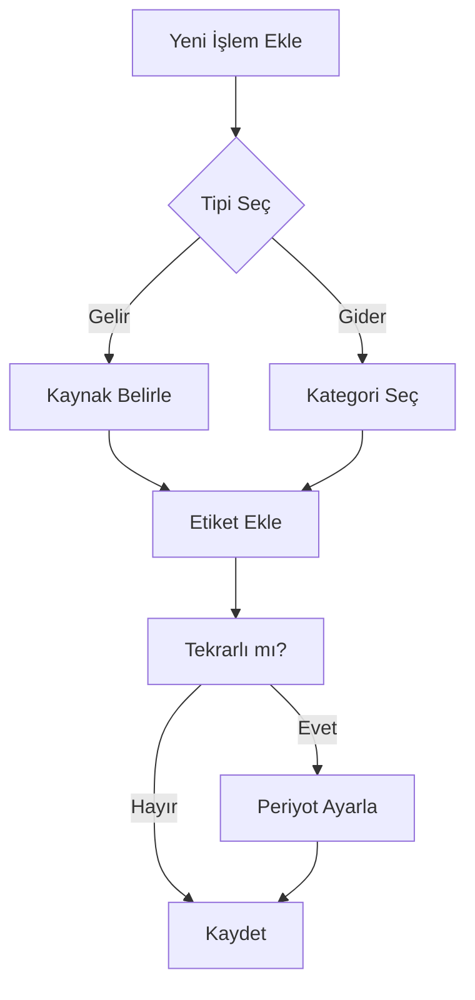
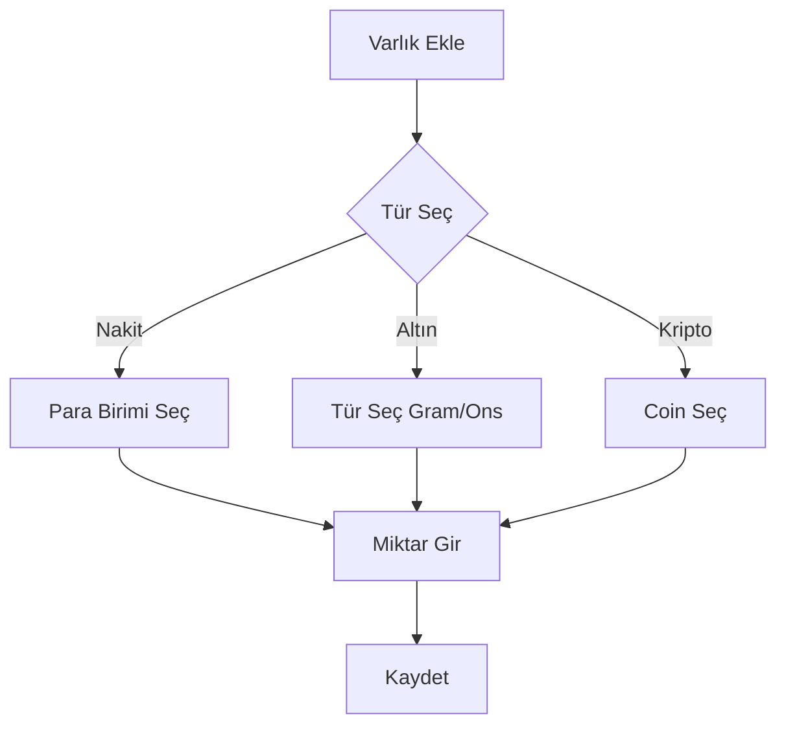

# Gelir-Gider Takip Uygulaması Dokümantasyonu

## 1. Proje Genel Bakış
**Proje Adı:** budget-track  
**Amaç:** Kullanıcıların finansal hareketlerini, varlıklarını ve yatırımlarını tek bir platformda yönetebilecekleri mobil odaklı bir çözüm sunmak.  
**Temel Özellikler:**
- Gelir/Gider Takibi
- Tekrarlı/Tek Seferlik İşlem Yönetimi
- Ödeme Durum Takibi
- Etiket Bazlı Kategorizasyon
- Çoklu Varlık Yönetimi
- Anlık Kur Takip Sistemi

**Hedef Kitle:** Bireysel kullanıcılar, küçük işletmeler, serbest çalışanlar  
**Proje Türü:** Açık Kaynak (MIT Lisansı)

---

## 2. Proje Hedefleri
### 2.1 Temel Hedefler
- **İşlem Yönetimi:**
  - Tek seferlik/tekrarlı gelir-gider kaydı
  - Ödeme durumu takibi (Ödendi/Bekliyor/İptal)
  - Vade tarihi ve hatırlatıcı entegrasyonu
- **Etiket Sistemi:**
  - Özelleştirilebilir kategoriler
  - Çoklu etiketleme ve filtreleme
- **Varlık Takibi:**
  - Gerçek zamanlı döviz/altın/kripto kurları
  - Portföy analiz araçları
- **Raporlama:**
  - Özelleştirilebilir zaman aralıkları
  - PDF/Excel çıktı desteği

### 2.2 Uzun Vadeli Hedefler
- Makine öğrenmesi tabanlı finansal öngörüler
- Çoklu kullanıcılı işbirliği özellikleri

---

## 3. Teknik Spesifikasyonlar
### 3.1 Mimari
**Frontend:**
- **Framework:** React Native + Expo
- **State Management:** Redux Toolkit
- **Localization:** i18next

### 3.2 Veri Modelleri
```typescript
interface Transaction {
  id: string;
  amount: number;
  type: 'income' | 'expense';
  category: string;
  tags: string[];
  paymentStatus: 'paid' | 'pending' | 'cancelled';
  recurrence?: {
    type: 'daily' | 'weekly' | 'monthly' | 'yearly';
    endDate?: Date;
  };
  currency: 'TRY' | 'USD' | 'EUR' | 'XAU';
  date: Date;
}

interface Asset {
  type: 'cash' | 'gold' | 'crypto' | 'forex';
  amount: number;
  currency: string;
  currentValue?: number;
  lastUpdated: Date;
}
```

---

## 4. Kullanıcı Akışları
### 4.1 Temel İşlem Akışı


### 4.2 Varlık Takip Akışı
